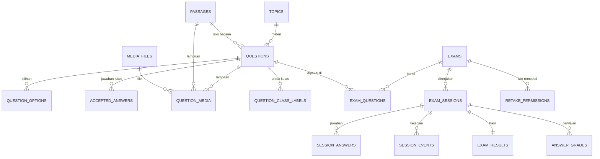

# English Daily Test Platform — Dokumen Desain (Draf 4)

> **Status: draf untuk kamu tinjau dan setujui. Belum ada kode yang ditulis atau diubah.**
>
> Isi: (1) Product Requirements, (2) Feature Architecture, (3) Data Model, (4) Aturan anti-cheating, (5) Peta fase, (6) Keputusan yang masih terbuka, (7) Risiko.
>
> Semua yang tertulis sebagai **keputusan** berasal dari jawabanmu di wawancara. Hal yang saya tambahkan sendiri diberi label **[USULAN]** dan baru berlaku setelah kamu setujui.
>
> Label prioritas: **[WAJIB]** tanpa ini aplikasi tidak layak dipakai · **[PENTING]** sangat berguna, dikerjakan setelah yang wajib · **[OPSIONAL]** bagus kalau ada waktu · **[DITUNDA]** sengaja tidak dikerjakan sekarang.

## Perubahan dari Draf 3

| Yang berubah | Dampak pada rancangan |
|---|---|
| Audit v1 selesai (lihat dokumen audit) | Temuan yang dipakai sebagai syarat v2 ditambahkan sebagai BR-20 sampai BR-22 (berlabel usulan) dan tugas Fase 1 |
| Kelas siswa diketik bebas, dijawab ulang setelah diketahui v1 memakai dropdown 3 kelas tetap | D-01 dikonfirmasi; rancangan tidak berubah |
| Tingkat kesulitan memakai istilah v1: **Easy / Medium / HOTS** | Nilai `difficulty` di data model diganti |
| Mockup Fase 0 (putaran 1 dan 2) disetujui | Bagian baru 1.8 mencatat arah dan layar acuan; Fase 0 selesai |
| Mockup menambah rincian pengaturan ujian | Kolom baru `draw_per_student` dan `tab_switch_flag_limit`; status sesi `timed_out` |
| Tidak ada perbaikan untuk v1 yang sedang live | D-15; risiko v1 tetap tercatat di bagian 7 |
| Urutan kerja: mockup dulu, baru Fase 1 | D-14 diputuskan |
| Notifikasi diputuskan: di dashboard guru dan email ke guru | D-06; modul Notification masuk Fase 7 |

---

## 1. Product Requirements

### 1.1 Tujuan aplikasi

Platform tes Bahasa Inggris untuk **ulangan harian** di **satu sekolah**, dipakai kelas X, XI, dan XII di semua jurusan. Guru membuat soal dan ujian sendiri tanpa mengubah kode. Siswa mengerjakan di ruang kelas dengan perangkat pribadi (HP atau laptop) di bawah pengawasan guru. Penilaian pilihan ganda, benar/salah, dan isian singkat otomatis; esai dinilai manual oleh guru.

Bukan tujuan saat ini: dipakai banyak sekolah, ujian dari rumah tanpa pengawas, latihan mandiri tanpa nilai, ujian semester (PTS/PAS).

### 1.2 Pengguna dan role

| Role | Siapa | Cara masuk | Bisa | Tidak bisa |
|---|---|---|---|---|
| **Student** | Siswa X, XI, XII | Tanpa akun: ketik nama dan kelas, lalu memasukkan **kode ujian** | Mengerjakan ujian yang kodenya ia masukkan; melihat hasil sesuai pengaturan ujian | Melihat soal/nilai lain, mengubah data |
| **Teacher** | 1 guru pengelola | Email + password (Supabase Auth) | Mengelola bank soal, media, ujian, izin remedial, tambah waktu, menilai esai, memantau ujian, melihat hasil dan statistik, mengekspor | Mengelola akun, backup, dan audit log sistem |
| **Admin** | Kamu (membantu guru) | Email + password (Supabase Auth) | Semua hak Teacher, ditambah kelola akun guru/admin, backup, audit log, pengaturan sistem | — |

Keputusan: nilai siswa hanya bisa dilihat guru dan admin, dan pembagian hak Teacher vs Admin seperti tabel di atas.

### 1.3 Ruang lingkup

**Masuk versi 2:** semua fitur di 1.4 berlabel WAJIB, PENTING, OPSIONAL.

**Sengaja tidak dikerjakan sekarang:**
- Multi-sekolah (data terpisah per sekolah)
- Akun individual siswa (NIS + password)
- Daftar kelas resmi dan penargetan ujian ke kelas tertentu (kelas diketik bebas)
- Jenis soal matching dan jenis soal listening khusus (audio dilampirkan ke soal biasa atau teks bacaan)
- Riwayat versi soal (hasil lama tetap aman karena tiap sesi menyimpan salinan soalnya)
- Leaderboard dan achievement (tidak direkomendasikan: nama siswa bisa diketik bebas)
- Multi-guru dengan pembagian hak per guru

**Notifikasi:** di dashboard guru dan lewat email (D-06). Arah desain sudah disetujui lewat mockup Fase 0 (bagian 1.8).

### 1.4 Fitur utama dan prioritas

**[WAJIB]**
- Login guru/admin dengan email + password, termasuk reset password
- Bank soal dengan 4 jenis soal: pilihan ganda, benar/salah, isian singkat, esai
- Pengelompokan soal: label kelas (kelas spesifik, boleh lebih dari satu), materi/topik, tingkat kesulitan; pencarian dan filter
- Editor soal lewat form (teks bacaan, pilihan, kunci jawaban, pembahasan, bobot nilai)
- Pembuatan ujian: judul, durasi, passing grade, jadwal atau buka/tutup manual, **kode ujian (wajib)**, randomisasi soal dan pilihan, bobot per soal
- Sesi ujian: timer dari server, simpan jawaban otomatis, lanjut setelah refresh, kumpulkan otomatis saat waktu habis
- Simpan jawaban di perangkat saat koneksi putus, kirim otomatis saat koneksi kembali
- Penilaian otomatis (pilihan ganda, benar/salah, isian singkat) dan penilaian manual esai
- Hasil per siswa dan ekspor CSV dan Excel (.xlsx)
- Anti-cheating dasar: catatan kejadian, peringatan, kumpulkan otomatis setelah batas
- Tampilan nyaman di HP (mobile-first) dan desktop
- Migrasi soal dan pengaturan dari versi 1 tanpa kehilangan data

**[PENTING]**
- Media pada soal: gambar dan audio (unggah oleh guru, pemutar audio tanpa batas putar)
- Penyusunan ujian otomatis dari filter (tingkat, materi, kesulitan, jumlah soal), selain pemilihan manual
- Impor soal dari Excel/CSV dan tempel banyak soal sekaligus dari Word/teks
- Preview soal seperti tampilan siswa
- Deteksi soal ganda saat impor atau input
- Duplikasi ujian dan template ujian
- Izin remedial untuk siswa tertentu
- Tambah waktu atau lanjutkan ujian siswa tertentu
- Monitor ujian yang sedang berlangsung
- Statistik: ringkasan per ujian, analisis per soal, perbandingan antar kelas (dengan penggabungan variasi nama kelas)
- Ekspor PDF rekap nilai per kelas
- Ekspor soal ke PDF/Word
- Audit log perubahan soal, nilai, dan pengaturan
- Backup manual (unduh file) dan backup otomatis terjadwal
- Notifikasi di dashboard guru (esai menunggu dinilai, kejadian mencurigakan) dan email ringkasan ke guru

**[OPSIONAL]**
- Riwayat nilai per siswa antar ujian (dicocokkan lewat nama, jadi tidak selalu akurat)

**[DITUNDA]** lihat 1.3.

### 1.5 Aturan bisnis

| No | Aturan | Sumber |
|---|---|---|
| BR-01 | Setiap siswa hanya boleh 1 kali mengerjakan sebuah ujian. Pembatasan berlaku untuk **nama + kelas yang sama**. Nama dan kelas dinormalisasi (abaikan huruf besar/kecil dan spasi ekstra); variasi lain (misalnya "Budi S.") dianggap siswa berbeda. | Keputusan |
| BR-02 | Percobaan ulang (remedial) hanya jika guru memberi izin untuk siswa tertentu. Izin berlaku satu kali pakai. | Keputusan |
| BR-03 | **Setiap ujian punya kode ujian (wajib).** Siswa menemukan ujian dengan memasukkan kode. Ujian hanya bisa dimulai lewat kode selama statusnya terbuka atau dalam jadwal. | Keputusan (mengubah versi sebelumnya) |
| BR-04 | Ujian dibuka lewat tombol manual atau terjadwal (tanggal + jam mulai/selesai), dipilih per ujian. | Keputusan |
| BR-05 | Untuk ujian terjadwal, guru memilih per ujian: siswa yang terlambat tetap mendapat durasi penuh, atau waktunya terpotong sampai jam selesai. | Keputusan |
| BR-06 | Tiap soal punya bobot sendiri. Nilai = poin diperoleh ÷ total poin × 100. Passing grade diatur per ujian. | Keputusan |
| BR-07 | Jika ujian punya soal esai, hasil berstatus **menunggu penilaian** sampai semua esai dinilai guru. Nilai final = nilai otomatis + nilai esai. | Konsekuensi keputusan |
| BR-08 | Yang siswa lihat setelah mengumpulkan (tidak ada / nilai saja / nilai + pembahasan) diatur guru per ujian. Untuk ujian yang punya esai, guru juga memilih per ujian: tunggu nilai final (siswa hanya melihat "menunggu penilaian") atau tampilkan nilai sementara bagian otomatis dengan tanda "belum final". | Keputusan |
| BR-09 | Kunci jawaban tidak pernah dikirim ke browser siswa sebelum ujian dikumpulkan. | Sudah berlaku di v1 |
| BR-10 | Mengubah atau menghapus soal tidak memengaruhi sesi yang sedang berjalan maupun hasil lama, karena tiap sesi menyimpan salinan soalnya. | Sudah berlaku di v1 |
| BR-11 | Guru dapat menambah waktu atau membuka kembali sesi siswa tertentu (misalnya HP mati atau terkumpul otomatis karena salah pindah tab). Tindakan ini tercatat di audit log. | Keputusan |
| BR-12 | Jawaban yang dikirim dari cache perangkat setelah koneksi kembali diterima selama sesi belum melewati batas waktu. Pengiriman ulang tidak boleh membuat jawaban ganda. | Keputusan + desain |
| BR-13 | Audit log mencatat: perubahan soal, pengaturan ujian, penilaian/koreksi nilai, izin remedial, tambah waktu, penghapusan hasil. | Keputusan |
| BR-14 | Soal khusus jurusan ditandai lewat nama materi/topik, tidak ada kolom jurusan di soal. | Keputusan |
| BR-15 | Kelas yang diketik siswa dinormalisasi otomatis (abaikan huruf besar/kecil dan spasi ekstra). Guru bisa menggabungkan variasi penulisan yang tetap berbeda (misalnya "XII TJKT" dan "12 TJKT") di layar hasil; penggabungan dipakai di statistik dan ekspor. | Keputusan |
| BR-16 | Soal dan teks bacaan dapat dilampiri gambar dan audio. Audio boleh diputar tanpa batas. Batas ukuran: gambar sekitar 1 MB, audio maksimal 10 MB. | Keputusan |
| BR-17 | **[USULAN]** Kode ujian dibuat otomatis (6 karakter huruf/angka), guru boleh menggantinya kapan saja, kode unik di antara ujian yang sedang terbuka, dan percobaan kode salah beruntun dibatasi di server agar tidak bisa ditebak. Mengganti kode tidak mengeluarkan siswa yang sudah mulai. | Usulan |
| BR-18 | Jawaban isian singkat dicocokkan dengan daftar jawaban yang diterima, dengan mengabaikan huruf besar/kecil dan spasi ekstra. Guru boleh mengoreksi penilaian isian singkat secara manual; koreksi tercatat di audit log. | Keputusan |
| BR-19 | Label kelas pada soal diketik bebas dengan saran otomatis dari label yang pernah dipakai, dinormalisasi seperti kelas siswa, dan satu soal boleh punya beberapa label. | Keputusan |
| BR-20 | **[USULAN]** Server menolak jawaban dan pengumpulan yang diterima setelah `ends_at` ditambah toleransi kecil (usulan 2 menit), kecuali guru menambah waktu atau membuka kembali sesi. Toleransi ini juga berlaku untuk jawaban yang dikirim dari cache perangkat (BR-12). | Temuan audit H-1 |
| BR-21 | **[USULAN]** Semua input divalidasi di server (panjang dan isi nama/kelas, tipe data jawaban). Permintaan mulai ujian dan percobaan kode dibatasi lajunya. Sesi yang tidak dikumpulkan ditandai `timed_out` dan dibersihkan berkala. | Temuan audit H-5, M-10 |
| BR-22 | **[USULAN]** Teks soal dan teks bacaan dibersihkan (sanitasi HTML) saat disimpan dan ditampilkan. Pesan error untuk pengguna bersifat umum, detail hanya di log. Status hasil disimpan sebagai kode netral (`passed`/`failed`/`not_final`) dengan label tampilan berbahasa Inggris. | Temuan audit M-4, M-5, M-8 |

### 1.6 Alur penggunaan

**Siswa**
1. Membuka alamat aplikasi di HP atau laptop.
2. Mengisi nama, kelas, dan **kode ujian** yang ditulis guru di papan.
3. Sistem memeriksa kode dan aturan 1 kali (BR-01, BR-02), lalu menampilkan petunjuk ujian.
4. Mengerjakan: navigasi soal, tandai ragu-ragu, jawaban tersimpan otomatis, timer terlihat; gambar dan audio tampil di soal.
5. Mengumpulkan (ada konfirmasi soal yang belum dijawab), atau terkumpul otomatis saat waktu habis atau batas pelanggaran terlewati.
6. Melihat hasil sesuai pengaturan ujian.

**Guru**
1. Login → Dashboard (ujian aktif, esai menunggu dinilai, ringkasan terbaru).
2. Bank Soal: tambah lewat form, impor Excel/CSV, atau tempel dari Word; unggah gambar/audio; preview; cek soal ganda.
3. Buat Ujian: atur pengaturan, pilih soal manual atau dari filter, atur jadwal, kode, dan aturan pelanggaran.
4. Buka ujian, tulis kode di papan → Monitor live selama berlangsung.
5. Nilai esai → lihat hasil dan statistik (gabungkan variasi nama kelas bila perlu) → ekspor.
6. Bila perlu: beri remedial, tambah waktu, duplikasi ujian untuk kelas lain.

**Admin**
Login → semua yang bisa dilakukan guru, ditambah kelola akun, backup, audit log, dan pengaturan sistem.

### 1.7 Kebutuhan non-fungsional

- **Perangkat:** utamanya HP siswa (layar kecil, sering ada notifikasi masuk, kuota data terbatas). Desain dimulai dari mobile.
- **Beban:** 30-35 siswa mengerjakan bersamaan per kelas; sistem dirancang aman untuk beberapa kelas bersamaan.
- **Koneksi:** tahan koneksi putus-nyambung (jawaban di perangkat, dikirim ulang otomatis).
- **Media:** gambar sekitar 1 MB dan audio maksimal 10 MB. **[USULAN]** gambar dikompres otomatis di browser guru saat unggah dan diberi cache di HP siswa agar lebih ringan.
- **Bahasa tampilan:** Bahasa Inggris saja (keputusan).
- **Keamanan:** validasi input di server, kunci jawaban tidak keluar dari server, akun guru/admin dengan Supabase Auth, seluruh akses data lewat Edge Functions (tabel tetap terkunci untuk akses langsung).
- **Perawatan:** kode modular, tanpa duplikasi, penamaan konsisten, error ditangani dengan pesan jelas.

### 1.8 Desain visual (Fase 0, disetujui)

Arah **"lembar jawaban"**: pulpen biru, stabilo kuning, dan bulatan jawaban A-D seperti lembar ujian. Bulatan jawaban adalah satu-satunya elemen yang dibuat berkarakter; sisanya tenang supaya siswa fokus pada soal dan guru fokus pada data. Seluruh teks di dalam aplikasi berbahasa Inggris.

| Elemen | Ketentuan |
|---|---|
| Warna | Tinta #16233B (teks), pulpen biru #2457D6 (aksi dan jawaban), stabilo #FFD84D (ditandai dan "belum final"), pulpen merah #D9364A (salah dan peringatan), hijau #1E8E5A (benar dan lulus), kertas #F7F9FC (latar) |
| Huruf | Bricolage Grotesque untuk antarmuka, judul, angka, dan tabel; Source Serif 4 untuk teks bacaan dan soal |
| Bulatan jawaban | Kosong = belum dijawab, biru = dijawab, kuning = ditandai untuk dicek ulang, cincin hitam = soal yang sedang dibuka; dipakai di pilihan jawaban dan daftar nomor soal |
| Perangkat | Siswa: layar HP 360 px, tombol minimal 44 px. Guru: laptop, menu kiri sama di semua layar |

Layar acuan yang sudah disetujui:
- **Siswa (HP):** masuk (nama, kelas, kode ujian), mengerjakan soal dengan audio, daftar nomor soal, hasil dengan "Not final", peringatan keluar halaman, koneksi putus, tidak bisa masuk
- **Guru (laptop):** dashboard, bank soal, editor soal, membuat ujian, monitor ujian, menilai esai, hasil (Scores), hasil (Questions dan Classes)

Mockup: [putaran 1](https://claude.ai/artifact/VRMcnaVHJDMSWT7HcbR9Sk) dan [putaran 2](https://claude.ai/artifact/TT672MxuZqfPaEGX29W5SL). Tingkat kesulitan di seluruh aplikasi memakai istilah **Easy / Medium / HOTS**.

---

## 2. Feature Architecture

### 2.1 Modul

Modul Major/Department Management dan Class Management **tidak dibuat**: jurusan cukup ada di nama materi/topik, dan kelas diketik bebas (hanya dinormalisasi dan bisa digabung di layar hasil).

| Modul | Tanggung jawab | Fase | Bergantung pada |
|---|---|---|---|
| Authentication | Login/logout/reset password guru dan admin; verifikasi role | 1 | — |
| User Management | Buat dan nonaktifkan akun guru/admin | 1 | Authentication |
| Topic Management | Daftar materi/topik | 2 | — |
| Media Management | Unggah, simpan, dan sajikan gambar/audio; pemutar audio | 2 | — |
| Question Bank | Simpan, cari, filter, arsipkan soal | 2 | Topic, Media |
| Question Editor & Import | Form soal, impor Excel/CSV, tempel dari Word, preview, deteksi ganda | 2 | Question Bank |
| Exam Management | Buat/duplikasi ujian, template, kode ujian, pemilihan soal manual/otomatis, aturan | 2 | Question Bank |
| Exam Session (Engine) | Validasi kode, mulai sesi, acak, timer, simpan jawaban, offline sync, kumpulkan, jadwal, percobaan | 3 | Exam Management |
| Scoring & Grading | Nilai otomatis, penilaian esai manual, koreksi | 4 | Exam Session |
| Result | Hasil per siswa, tampilan hasil ke siswa, penggabungan nama kelas | 4 | Scoring |
| Analytics | Ringkasan ujian, analisis per soal, perbandingan kelas, riwayat siswa | 4 | Result |
| Export | CSV, Excel, PDF rekap, ekspor soal PDF/Word | 2 dan 4 | Question Bank, Result |
| Anti-Cheating & Monitoring | Catatan kejadian, level peringatan, tindakan otomatis, monitor live | 5 | Exam Session |
| Dashboard | Ringkasan untuk guru dan admin | 6 | Semua |
| Settings | Pengaturan sistem | 1 dan 6 | — |
| Audit Log | Catat perubahan penting; halaman lihat riwayat | 1 (mencatat), 7 (tampilan) | Semua |
| Backup/Recovery | Unduh backup manual, backup otomatis terjadwal | 7 | — |
| Notification | Notifikasi di dashboard guru (esai menunggu dinilai, kejadian mencurigakan) dan email ringkasan ke guru | 7 | Result, Anti-Cheating, Exam Session |

### 2.2 Prinsip arsitektur kode **[USULAN]**

- **Pola sekarang dipertahankan:** frontend HTML/CSS/JS tanpa build step + Supabase Edge Functions; tabel tetap RLS aktif tanpa policy, semua akses lewat Edge Functions.
- **Frontend dipecah per peran dan per fitur** dengan native ES modules (bukan variabel global seperti sekarang).
- **Edge Functions dipecah per domain** (soal, media, ujian, sesi, penilaian, hasil, audit, backup) dengan kode bersama untuk validasi, autentikasi, dan penanganan error.
- **Validasi selalu di server**, validasi di browser hanya untuk kenyamanan.
- **Perubahan bertahap:** aplikasi v1 yang sedang dipakai tidak dibongkar total; lihat D-11 untuk cara agar tetap aman.

Struktur folder frontend yang diusulkan:

```
index.html                  → halaman siswa
teacher/index.html          → halaman guru & admin
assets/
  css/                      → base, components, per halaman
  js/
    core/                   → config, api client, router, error handling
    shared/                 → util, komponen UI, validasi, pemutar audio
    student/                → masuk (nama, kelas, kode), ujian, hasil
    teacher/                → dashboard, bank-soal, media, ujian, monitor, hasil, analitik
    admin/                  → akun, backup, audit log
```

---

## 3. Data Model

### 3.1 Prinsip

- Semua tabel: `id` bertipe UUID, `created_at`, `updated_at`.
- Soal tidak dihapus permanen jika sudah dipakai ujian; soal **diarsipkan** (`is_archived`).
- JSONB hanya untuk salinan (snapshot) dan data kejadian, bukan untuk data inti yang perlu di-query.
- Status memakai enum, bukan teks bebas.
- RLS aktif di semua tabel tanpa policy; akses lewat Edge Functions dengan service role.
- Kelas dan nama siswa disimpan dua kali: teks asli (untuk tampilan) dan versi normalisasi (untuk pencocokan dan statistik).

### 3.2 Diagram relasi



### 3.3 Tabel

**Pengguna dan master data**

| Tabel | Kolom penting | Catatan |
|---|---|---|
| `profiles` | id (= auth.users.id), full_name, role (`teacher`/`admin`), is_active | Menggantikan `app_config.teacher_password` |
| `topics` | name, level (opsional) | Materi/topik; nama jurusan bisa dimasukkan di sini (BR-14) |
| `class_aliases` | alias_normalized (unik), display_name | Penggabungan variasi nama kelas oleh guru (BR-15); tanpa entri berarti kelas tampil apa adanya |

**Bank soal dan media**

| Tabel | Kolom penting | Catatan |
|---|---|---|
| `passages` | title, body | Teks bacaan yang bisa dipakai beberapa soal (v1 menyimpannya per soal) |
| `questions` | type (`multiple_choice`/`true_false`/`short_answer`/`essay`), topic_id, difficulty (`easy`/`medium`/`hots`), passage_id, body, explanation, default_weight, essay_guidance, content_hash, is_archived, created_by | `content_hash` untuk deteksi soal ganda |
| `question_options` | question_id, position, body, is_correct | Untuk pilihan ganda dan benar/salah; menggantikan `correct_index` |
| `accepted_answers` | question_id, answer_text, answer_normalized | Jawaban yang diterima untuk isian singkat |
| `question_class_labels` | question_id, label_display, label_normalized | Label kelas pada soal; satu soal boleh punya beberapa; saran otomatis dari label yang sudah ada |
| `media_files` | kind (`image`/`audio`), storage_path, mime_type, size_bytes, uploaded_by | File disimpan di Supabase Storage |
| `question_media` | media_id, question_id (atau passage_id), position | Satu media dilampirkan ke soal atau teks bacaan |

**Ujian**

| Tabel | Kolom penting | Catatan |
|---|---|---|
| `exams` | title, description, status (`draft`/`open`/`closed`), duration_minutes, passing_grade, availability_mode (`manual`/`scheduled`), starts_at, ends_at, late_start_policy (`full_duration`/`cut_at_end`), access_code (wajib), selection_mode (`manual`/`auto`), auto_filter (jsonb), pool_size, draw_per_student, randomize_questions, randomize_options, result_visibility (`none`/`score`/`score_and_review`), essay_pending_display (`hide_score`/`show_partial`), tab_switch_warn_limit, tab_switch_flag_limit, tab_switch_autosubmit_limit, is_template, created_by | Menggantikan `exam_settings` (yang hanya satu baris). Kode unik di antara ujian yang berstatus terbuka. |
| `exam_questions` | exam_id, question_id, position, weight | Untuk pemilihan manual; bobot bisa berbeda dari default soal |
| `retake_permissions` | exam_id, student_name_normalized, student_class_normalized, granted_by, granted_at, used_at | Izin remedial satu kali pakai |

**Sesi, jawaban, dan hasil**

| Tabel | Kolom penting | Catatan |
|---|---|---|
| `exam_sessions` | exam_id, student_name, student_name_normalized, student_class, student_class_normalized, attempt_no, status (`in_progress`/`submitted`/`auto_submitted`/`timed_out`/`reopened`), started_at, ends_at, extra_seconds, last_heartbeat_at, questions_snapshot (jsonb, tanpa kunci, termasuk rujukan media), answer_key (jsonb, hanya server), tab_switch_count | Salinan soal per sesi; indeks di (exam_id, student_name_normalized, student_class_normalized) untuk aturan 1 kali |
| `session_answers` | session_id, question_id, answer (jsonb), is_flagged, answered_at, client_saved_at | Unik (session_id, question_id) supaya kirim ulang dari cache tidak membuat data ganda |
| `answer_grades` | session_id, question_id, points_awarded, graded_by (null = otomatis), feedback, graded_at | Nilai per soal; esai diisi guru |
| `exam_results` | session_id (unik), total_points, max_points, percentage, status (`pending_review`/`graded`), pass_status, correct_count, wrong_count, time_used_seconds, review_snapshot | Hasil akhir per sesi |

**Anti-cheating, kontrol, dan sistem**

| Tabel | Kolom penting | Catatan |
|---|---|---|
| `session_events` | session_id, event_type, severity (`info`/`warning`/`suspicious`/`violation`), meta (jsonb), occurred_at | Pindah tab, kehilangan fokus, reload, offline/online, dll. |
| `audit_logs` | actor_id, action, entity_type, entity_id, changes (jsonb), created_at | BR-13 |
| `backups` | kind (`manual`/`automatic`), storage_path, size_bytes, created_by, created_at | Bergantung D-11 dan paket Supabase |

**Media dan keamanan file [USULAN]:** bucket Storage bersifat privat; siswa hanya mendapat tautan berumur pendek untuk media pada ujian yang sedang ia kerjakan.

### 3.4 Migrasi dari v1

| v1 | v2 |
|---|---|
| `questions` (40 soal, `correct_index`) | `questions` + `question_options` (`is_correct`); tipe = pilihan ganda; passage dipindah ke `passages` bila ada yang sama |
| `exam_settings` (1 baris) | 1 baris di `exams` (dari pengaturan sekarang) plus kode ujian baru |
| `exam_sessions`, `exam_results` | Dipindah atau diarsipkan (masih perlu keputusan kamu, D-13) |
| `app_config.teacher_password` | Dihapus setelah login lewat Supabase Auth berjalan |

---

## 4. Aturan Anti-Cheating

Sistem membedakan empat tingkat. Karena guru mengawasi langsung dan siswa memakai HP pribadi (notifikasi masuk bisa terhitung "pindah tab"), pendekatannya sengaja tidak agresif.

| Tingkat | Contoh kejadian | Yang terjadi | Konsekuensi |
|---|---|---|---|
| **Warning** | Pindah tab/aplikasi, halaman kehilangan fokus | Siswa melihat pesan bahwa kejadian tercatat, plus hitungan | Tidak memengaruhi nilai |
| **Suspicious** | Pindah tab berulang, reload di tengah ujian, sering putus-nyambung | Dicatat di log, terlihat di monitor guru | Hanya informasi untuk guru |
| **Violation** | Melewati batas kejadian yang ditetapkan guru per ujian | Dicatat sebagai pelanggaran, guru diberi tahu di monitor | Bisa memicu tindakan otomatis |
| **Automatic action** | Batas pelanggaran terlewati | Ujian dikumpulkan otomatis | Guru bisa membuka kembali (BR-11) bila ternyata salah tanda |

**Default (keputusan)**, bisa diubah guru per ujian: warning mulai kejadian ke-1, suspicious mulai ke-3, violation dan kumpulkan otomatis di kejadian ke-5. **[USULAN]** nilai 0 berarti kumpulkan otomatis dinonaktifkan. Deteksi keluar fullscreen hanya di desktop karena fullscreen tidak andal di HP. Memutar audio tidak dihitung sebagai kejadian.

Pendukung lain: randomisasi soal dan pilihan, timer server, validasi sesi, satu percobaan per nama + kelas, kode ujian wajib.

Batasan yang jujur: browser tidak bisa mengunci perangkat siswa. Semua ini bersifat pencegah dan bukti, bukan pengamanan mutlak; pengawasan guru di kelas tetap yang utama.

---

## 5. Peta Fase

| Fase | Isi | Hasil yang bisa dicoba |
|---|---|---|
| **0 Desain visual (selesai)** | Arah "lembar jawaban" dan mockup 15 layar (putaran 1 dan 2) sudah disetujui; hasilnya dicatat di 1.8 | Mockup yang disetujui |
| **1 Foundation** | Proyek Supabase dev terpisah, struktur project modular, skema database v2 + migrasi, Supabase Auth untuk guru/admin, role, audit log (mencatat), penegakan waktu dan validasi di server (BR-20 dan BR-21) | Login guru/admin baru; data v1 termigrasi |
| **2 Core** | Materi, bank soal 4 jenis, editor, unggah gambar/audio, impor Excel/CSV dan Word, preview, deteksi ganda, pembuatan ujian dengan kode (manual + otomatis), duplikasi/template, ekspor soal PDF/Word | Guru membuat soal dan ujian utuh |
| **3 Exam Engine** | Validasi kode, sesi, timer, acak, simpan jawaban, sinkron offline, kumpulkan, jadwal, batas 1 kali, remedial, tambah waktu | Siswa mengerjakan ujian penuh |
| **4 Result** | Penilaian otomatis, layar penilaian esai, hasil, statistik, penggabungan nama kelas, ekspor CSV/Excel/PDF | Guru menilai dan menganalisis |
| **5 Anti-Cheating** | Log kejadian, 4 tingkat, tindakan otomatis, monitor live | Guru memantau ujian berlangsung |
| **6 UX** | Dashboard, penyempurnaan mobile, aksesibilitas dasar, penyesuaian dari mockup yang disetujui | Tampilan matang |
| **7 Advanced** | Backup manual dan otomatis, halaman audit log, notifikasi (jika diputuskan), fitur tambahan yang disetujui | Siap dipakai penuh |

Prinsip: satu fase selesai dan stabil sebelum lanjut, dan setiap fase diakhiri pengujian.

---

## 6. Keputusan

**Sudah diputuskan**

| No | Keputusan |
|---|---|
| D-01 | Kelas siswa diketik bebas (dinormalisasi otomatis, bisa digabung guru) |
| D-02 | Siswa menemukan ujian dengan memasukkan kode ujian (kode wajib untuk semua ujian) |
| D-03 | "Kelas" pada soal berarti kelas spesifik (mis. XII TJKT 1), diketik bebas dengan saran otomatis; satu soal boleh punya beberapa label |
| D-04 | Soal mendukung gambar dan audio; audio tanpa batas putar |
| D-05 | Desain ulang yang lebih modern; mockup putaran 1 dan 2 sudah disetujui |
| D-07 | Teacher mengelola soal dan ujian; Admin ditambah akun, backup, audit log, pengaturan sistem |
| D-08 | Isian singkat: abaikan huruf besar/kecil dan spasi ekstra, daftar jawaban diterima, guru boleh mengoreksi manual; nama siswa dianggap sama bila hanya beda huruf besar/kecil dan spasi ekstra |
| D-09 | Batas pindah tab default 1 / 3 / 5 kejadian, bisa diubah per ujian |
| D-10 | Untuk ujian dengan esai, tampilan hasil ke siswa dipilih guru per ujian |
| D-11 | v2 dikembangkan di proyek Supabase terpisah (dev); v1 tetap berjalan sampai v2 lolos uji |
| D-12 | Batas media: gambar sekitar 1 MB, audio maksimal 10 MB |
| D-14 | Mockup (Fase 0) selesai dan disetujui dulu, baru mulai Fase 1 |
| D-06 | Notifikasi di dashboard guru dan email ke guru (misalnya ringkasan setelah ujian selesai) |
| D-15 | Tidak ada perbaikan untuk v1 yang sedang live; menunggu v2 |

**Masih terbuka**

| No | Pertanyaan | Rekomendasi saya (kamu yang memutuskan) | Memengaruhi |
|---|---|---|---|
| **D-13** | Data hasil ujian v1: dipindah ke v2 atau diarsipkan? | Diarsipkan (diekspor ke CSV/Excel) karena strukturnya berbeda; soal tetap dimigrasi | Migrasi di Fase 1 |

---

## 7. Risiko dan Catatan

1. **Nama dan kelas diketik bebas:** batas 1 kali dan riwayat per siswa hanya akurat untuk nama yang sama. Variasi nama kelas yang tidak sekadar huruf besar/kecil dan spasi (misalnya "XII" vs "12") baru rapi setelah guru menggabungkannya. Ini konsekuensi keputusan; bisa diperkuat nanti dengan daftar siswa dan daftar kelas tanpa mengubah keseluruhan sistem.
2. **Kode ujian bisa dibagikan:** siswa di luar kelas yang mendapat kode bisa ikut ujian. Mitigasi: kode hanya berlaku saat ujian terbuka, guru bisa mengganti kode kapan saja, dan pengawasan di kelas.
3. **Esai membuat nilai tidak instan:** butuh layar penilaian dan status "menunggu penilaian" di semua tampilan hasil dan statistik.
4. **Notifikasi HP dianggap pindah tab:** batas otomatis kumpulkan tidak boleh terlalu ketat; guru selalu bisa membuka kembali (BR-11).
5. **Sinkron offline:** butuh aturan yang teliti soal batas waktu dan data ganda (BR-12). Media (terutama audio) tidak bisa sepenuhnya disimpan di perangkat kalau koneksi putus; unduh di awal ujian membuat lebih tahan tetapi memakai kuota data siswa. Ini perlu diuji di kelas nyata.
6. **Kuota dan biaya:** paket gratis punya kuota lalu lintas data sekitar 5 GB tanpa cache dan 5 GB dengan cache per bulan, gabungan semua layanan. Dengan batas audio 10 MB, satu kelas 35 siswa bisa memakai sekitar 350 MB per ujian bila tiap siswa mengunduh file sebesar itu. Kompres, cache di HP, dan file yang lebih kecil dari batas mengurangi ini. Kapasitas total Storage, backup otomatis, dan email reset password di paket gratis masih perlu saya verifikasi sebelum Fase 1.
7. **Aplikasi v1 sedang live:** v2 dikembangkan di proyek Supabase dev terpisah; v1 tidak disentuh sampai v2 lolos uji.
8. **Temuan audit v1 tetap berlaku selama v1 live:** waktu ujian tidak ditegakkan server, tidak ada batas percobaan, dan login guru masih rapuh. Kamu memutuskan tidak memperbaiki v1 (D-15); semuanya tertutup oleh v2. Rincian lengkap ada di dokumen audit.
9. **Email ke guru:** layanan email bawaan Supabase sangat terbatas dan hanya cocok untuk uji coba. Email ringkasan butuh layanan email tersendiri; pilihannya dibahas di Fase 7.
